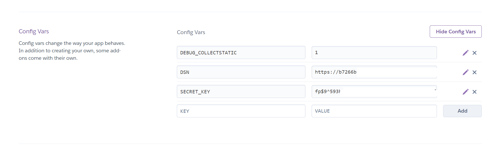
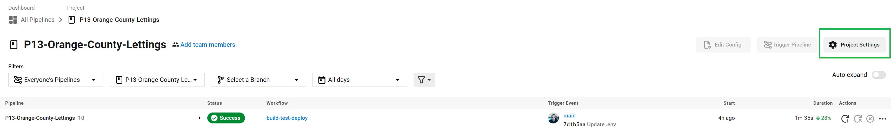
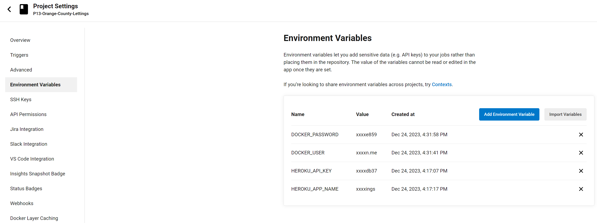
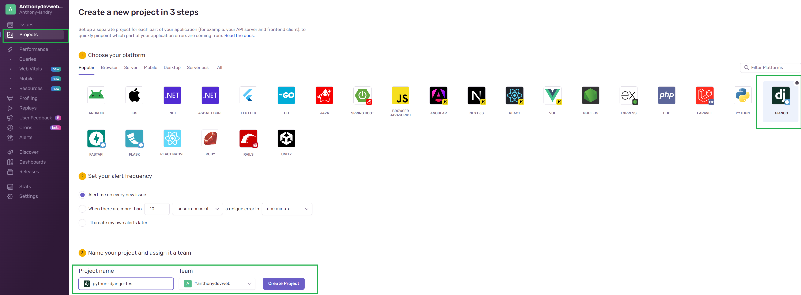
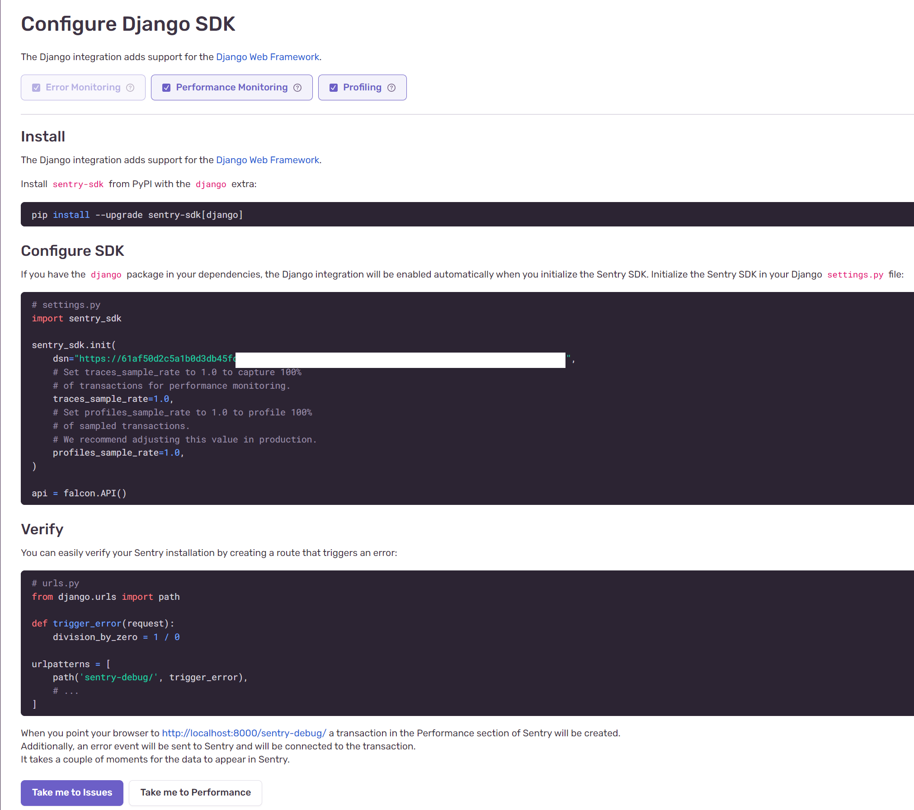

# OpenClassrooms: Projet 13 - Mettez à l'échelle une application Django en utilisant une architecture modulaire 


Projet réalisé dans le cadre de la formation OpenClassrooms Développeur d'Applications Python.


La documentation **READTHEDOCS** est disponible ici : https://p13-orange-county-lettings-anthony-landry.readthedocs.io/fr/latest/


## Installation

Pour commencer, assurez-vous d'avoir Python installé sur votre système.

Ensuite, suivez ces étapes pour installer et exécuter le programme :

1. Clonez ce dépôt dans le répertoire de votre choix en utilisant la commande suivante :

```bash
git clone https://github.com/Anthony-landry/P13-Orange-County-Lettings.git
```

1. Accédez au dossier P13-Orange-County-Lettings.

2. Créez un nouvel environnement virtuel en utilisant la commande suivante :

```bash
python -m venv env
```

1. Activez l'environnement virtuel :

* Sur Windows :

```bash
env\Scripts\activate.bat
```

* Sur Linux :

```bash
source env/bin/activate
```

1. Installez les packages requis en exécutant la commande suivante :

```bash
pip install -r requirements.txt
```
1. Remplir le fichier .env :

un fichier .env ce trouve à la racine du pojet,

Éditer le , puis enregistrer.

```bash
.env
SECRET_KEY='METTRE VOTRE CLE SECRET'
DSN="METTRE VOTRE DSN SENTRY.IO"
ALLOWED_HOSTS=0.0.0.0,127.0.0.1,.herokuapp.com
DEBUG="False"
```

Charger le fichier .env 

Pour **POWERSHELL**

copier ce code dans votre nterpréteur de commandes : 
```bash
Get-Content .env | ForEach-Object {
$line = $_ -split '='
$variable = $line[0].Trim()
$value = $line[1].Trim('"')
[System.Environment]::SetEnvironmentVariable($variable, $value, [System.EnvironmentVariableTarget]::Process)
}
```

Pour **CMD**

```bash
for /f "delims=" %i in (.env) do set %i
```

Pour **LINUX BASH**

```bash
export .env
```


1. placez vous à la racine du projet (là ou se trouve le fichier manage.py), puis effectuez les migrations :

```bash
python manage.py makemigrations
```

Puis,

```bash
python manage.py migrate
```

2. Vous pouvez maintenant lancer le script principal avec la commande :

```bash
python manage.py runserver
```

3. Vous pouvez ensuite utiliser l'applicaton à l'adresse suivante:

```bash
http://127.0.0.1:8000/
```

## Panel d'administration

- Aller sur `http://localhost:8000/admin`
- Connectez-vous avec l'utilisateur `admin`, mot de passe `Abc1234!`

## Pour lancer les tests unitaires :
10. Ouvrir la console et lancer la commande 

```bash
"python -m unittest -v"
```

## Pour lancer les tests unitaires :
11. Ouvrir la console et lancer la commande 

```bash
"flake8"
```
## Pour lancer les tests de coverage :

12. Ouvrir la console et lancer la commande 
```bash
"coverage run -m unittest discover; coverage report -m"
```
# Docker 

### Tirer une image existante de DockerHub pour exécuter l'application localement
- Télécharger l'image : [Docker](https://docs.docker.com/get-docker/)
- Allez sur le Docker repository: https://hub.docker.com/repository/docker/anthonydevweb/p13-orange-county-lettings/tags
- Prendre le dernier **TAG LATEST** 
- Utiliser cette ligne de commande **(en remplaçant par vos valeur)** :  `docker run -p 3050:8000 -e 'SECRET_KEY:"VOTRE SECRET KEY"' -e 'DSN:"VOTRE DSN SENTRY.IO"' -e 'ALLOWED_HOSTS:"0.0.0.0,127.0.0.1,.herokuapp.com"' anthonydevweb/p13-orange-county-lettings:latest` 

You can access the app in any web browser at http://127.0.0.1:8080/

docker run -p 3050:8000 -e 'SECRET_KEY:"VOTRE SECRET KEY"' -e 'DSN:"VOTRE DSN SENTRY.IO"' -e 'ALLOWED_HOSTS:"0.0.0.0,127.0.0.1,.herokuapp.com"' anthonydevweb/p13-orange-county-lettings:latest

# Heroku

- Créer votre New app.
- Utiliser le serveur europe.
- Aller sur **SETTINGS**
- Puis : Config Vars , faire **Reveal Config Vars**.
- Ajouter ensuite les clés  DEBUG_COLLECTSTATIC, DSN, SECRET_KEY,  et mettez vos valeur 




# CircleCI

- Creer un compte CircleCI ou connectez vous avec votre compte Github.
- Votre repository sera visble dans projet.
- mettre la branch sur Main ou Master en fonction de votre repo github.
- Cliquer sur **SETUP PROJET**
- le build se construit
- Ajouter vos variable d'environnement dans Project setting (encadrer vert)



- et ajouter vos varible d'environnement.



landry_anthony_P13_Orange_County_Lettings_openclassrooms_developpeur_application_python_circlec_2.png

# Sentry.io

- Creer un compte Sentry.io ou connectez vous avec votre compte Github.
- Puis se rendre sur **CREATE PROJET**
- Dans notre cas prendre un projet *DJANGO**



landry_anthony_P13_Orange_County_Lettings_openclassrooms_developpeur_application_python_sentry.png

- et récuperer votre clé DSN à ajouter au .env au dessus.

