.. |br| raw:: html

   <br />

Administration
==============

Les pages d'administration de Django permettent de visualiser, ajouter,
modifier et supprimer des données.

Gérer les profils
-----------------

Tout d'abord, vous devez ajouter un nouvel utilisateur.

|br|

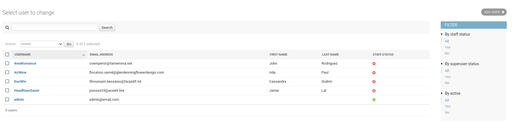

|br|

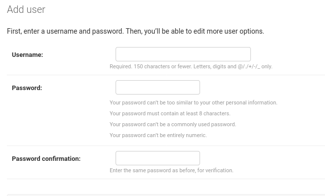

|br|

Vous pouvez ensuite gérer les profils.

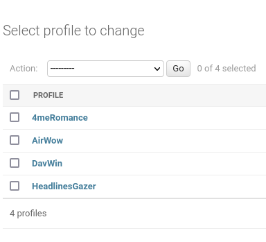

|br|

Un profil doit correspondre à un utilisateur existant. Un utilisateur ne peut
avoir qu'un seul profil.

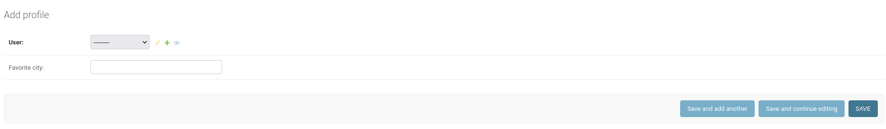

|br|

Gérer les adresses et les locations
-----------------------------------

Les locations sont liées à des adresses, vous devez donc d'abord ajouter une
adresse avant de créer une nouvelle location.

Captures d'écran des adresses
`````````````````````````````

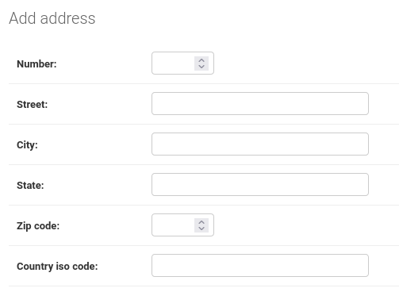

|br|

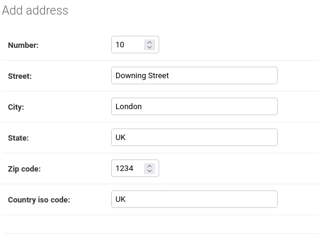

|br|

Le contenu des champs est également vérifié.

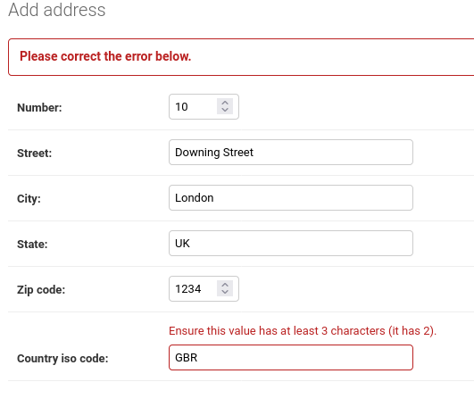

|br|

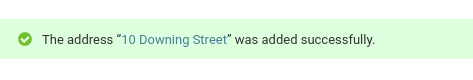

Captures d'écran des locations
``````````````````````````````

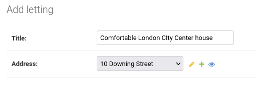

|br|

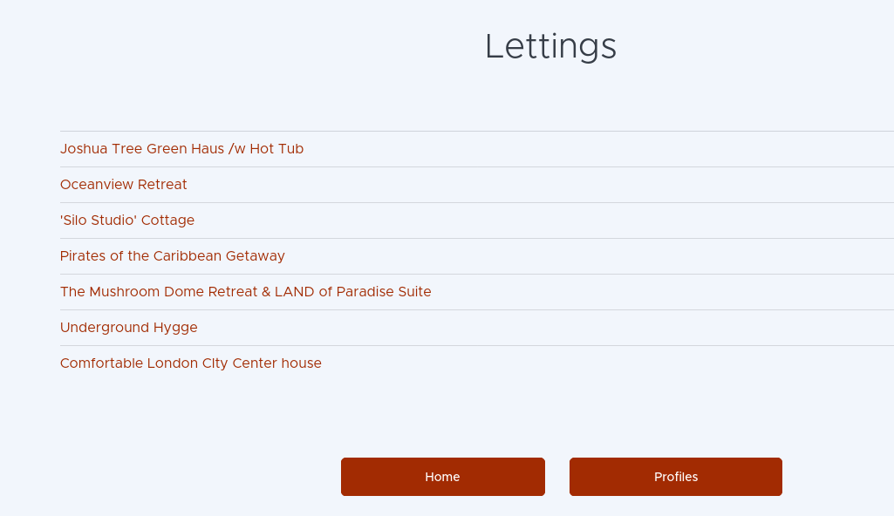

|br|

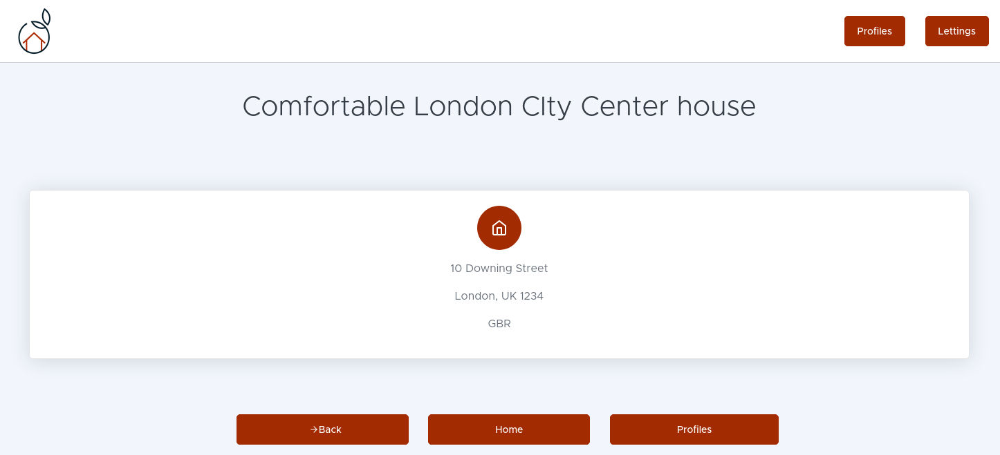
