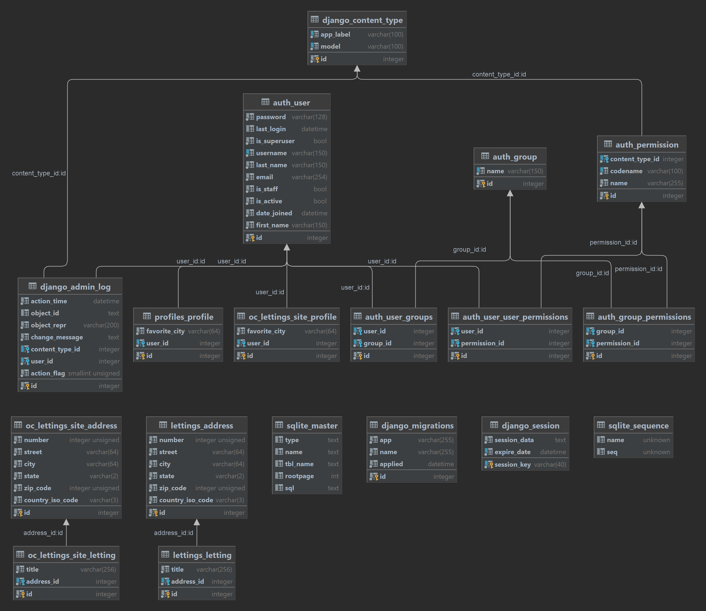

.. |br| raw:: html

   <br />

Structures de données et API
============================

Cette page contient une documentation générée automatiquement sur les API et la
structure des données de cette application.

Base de données
---------------

Le backend de base de données de choix pour cette application est
`SQLite <https://www.sqlite.org/index.html>`_.

Modèles de données
------------------

Les modèles correspondent aux tables de la base de données.

Les principaux modèles sont:

- User
- Profile
- Address
- Letting

Diagramme
`````````
|br|



|br|

API
```

.. automodule:: lettings.models
   :members:
   :show-inheritance:
   :undoc-members:
   :special-members:
   
.. automodule:: profiles.models
   :members:
   :show-inheritance:
   :undoc-members:
   :special-members:

Vues
----

Les vues sont ce que les utilisateurs voient avec un navigateur web. Ce sont
des pages web rendues à l'aide de template HTML.

API
```

.. automodule:: lettings.views
   :members:
   :show-inheritance:
   :undoc-members:
   :special-members:

.. automodule:: oc_lettings_site.views
   :members:
   :show-inheritance:
   :undoc-members:
   :special-members:

.. automodule:: profiles.views
   :members:
   :show-inheritance:
   :undoc-members:
   :special-members:

Apps
----

L'application *Orange County Lettings* est divisée en 3 sous-applications.

API
```

.. automodule:: lettings.apps
   :members:
   :show-inheritance:
   :undoc-members:
   :special-members:

.. automodule:: oc_lettings_site.apps
   :members:
   :show-inheritance:
   :undoc-members:
   :special-members:

.. automodule:: profiles.apps
   :members:
   :show-inheritance:
   :undoc-members:
   :special-members:

Tests
-----

Documentation des tests unitaires.

API
```

.. automodule:: lettings.tests
   :members:
   :show-inheritance:
   :undoc-members:
   :special-members:

.. automodule:: oc_lettings_site.tests
   :members:
   :show-inheritance:
   :undoc-members:
   :special-members:

.. automodule:: profiles.tests
   :members:
   :show-inheritance:
   :undoc-members:
   :special-members:
